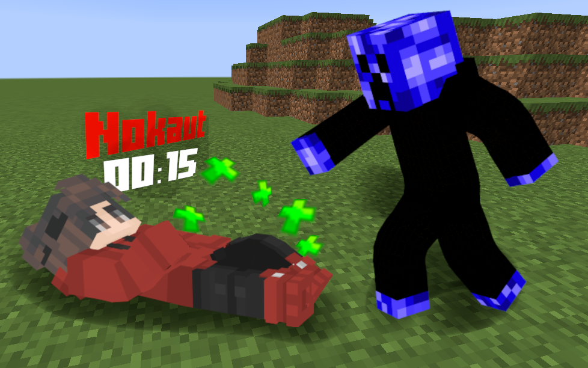

# 💀 Knockout

A modified version adding new features and English translation of [@smaks6's](https://github.com/smaks6/) knockout plugin from the "Kwadratowa Masakra" server. You can download original version [here](https://www.spigotmc.org/resources/nokaut-knockout.85152/).
Graphics created by ZiorberYT.

Special thanks to @NetKuDev(https://github.com/NetKuDev) for help with English translation.



# 📝 Plugin configuration
```
# Enter knockout time (in seconds)
NokautTime: 120

# If the value is true, the player at the end of the countdown will die.
DeathOnEnd: true

# If the value is true, then during the knockout the player will get a blindness effect
BlindnessOnNokaut: true

# If your server is weak, you can set this value higher, but it is not recommended to go below 5-10
NpcTeleportTime: 1

# Show PlayerName above knockout player
showPlayerName: true

# Level required to revive someone
levelRequired: 1

# These commands will be executed if any player gets knocked Out (use "KnockedPlayer" and "Damager" variables)
commandsOnNokaut:
  - eco give 100 "Damager"

# These commands will be executed if any player dies (use "KnockedPlayer" and "Damager" variables)
commandsAfterNokaut:
  - eco give 500 "Damager"

# Player name when is knocked out (if showPlayerName is disabled)
knockoutNPCName: "&c*Knockout*"

# If the value is true, ops will receive a warning message (plugin is modified etc.)
sendWarning: true

messages:
  helpNokautMessage: "&8» &cYou must ask another player to revive you, before time runs out or you will die..."
  playerNotFound: "&8» &cNo such player was found!"
  noPlayerGiven: "&8» &cProvide player's nickname!"
  noPermission: "&8» &cNo permission!"
  playerNotKnockedOut: "&8» &cThis player isn't knocked out!"
  deathNowNot: "&8» &cThis command is only available during knockout!"
  cancelMessage: "&8» &cYou can't do that when you are knocked out!"
  wakeUpTitle: "&aReanimation in progress..."
  knockoutTitle: "&cKnockout!"
  aliveTitle: "&aYou are alive!"
  aliveSubtitle: "&fRevived by %player%"
  reanimationErrorTitle: "&cError!"
  reanimationErrorSubtitle: "&fYou must have at least 1 experience level to revive someone!"
  # %player% - player who knocked out, %knocked% - player who is knocked out
  knockoutBroadcast: "&8» &c%player% knocked out %knocked%"
  killerTitle: "&8» &eYou knocked down: &6%player% &8«"
  pickupPlayer: "&8» &aSuccessfully picked up player!"
  dropPlayer: "&8» &aSuccessfully dropped player!"
  adminCommandNoArgs: "&8» &cYou must provide an argument!"
  pluginReloaded: "&8» &aReloaded plugin!"
```

# ⚖️ Licensing

This plugin is released under [MIT License](https://github.com/AWmeister546/knockout/blob/c2a642ee4ecc23f7dace584bad8cf12cef8234e8/LICENSE) conditions.
